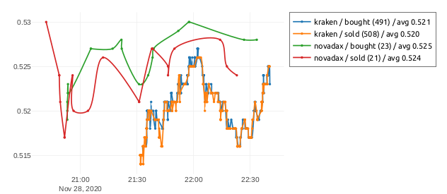

## Speculari
Esse sistema propõe uma base de análises gráficas para comparação entre preços de diferentes brokers, e eventual descoberta de oportunidades.

```
    - converte BRL:USD
    - baixa a cada segundos todos os tickers dos brokers
    - baixa histórico de compras e vendas dados X segundos
    - no browser, exige porcentagens de diferenças
```

---

#### Exemplo

Diferença de 2h entre Kraken e MercadoBitcoin para XRP, 




Conferir [PDF](doc/speculari.sample.pdf) exportado direto do browser.

